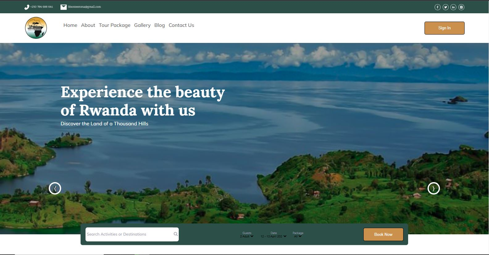

# 🌴 TOURISM TO RWANDA 🌴

Tour to Rwanda is a website that provides information about tourism in Rwanda. The site is built with [Create React App](https://github.com/facebook/create-react-app).
The site is a great resource for people who are interested in learning more about Rwanda and its tourism industry. It includes information 📊 about the country's history, culture, wildlife, and natural attractions. The site is easy to use and navigate. The information is presented in a clear and concise way. The site also includes a blog section with articles about Rwandan tourism.

Here are some of the features of the site:

- Information about Rwanda's history, culture, wildlife, and natural attractions
- Tips for planning a trip to Rwanda
- A blog section with articles about Rwandan tourism
- Clean code standards
- Tests for all of the components

## Project Preview

## Available Scripts

In the project directory, you can run:

### `npm start`

Runs the app in the development mode.\
Open [http://localhost:3000](http://localhost:3000) to view it in your browser.

The page will reload when you make changes.\
You may also see any lint errors in the console.

### `npm test`

Launches the test runner in the interactive watch mode.\
See the section about [running tests](https://facebook.github.io/create-react-app/docs/running-tests) for more information.

### `npm run build`

Builds the app for production to the `build` folder.\
It correctly bundles React in production mode and optimizes the build for the best performance.

The build is minified and the filenames include the hashes.\
Your app is ready to be deployed!

See the section about [deployment](https://facebook.github.io/create-react-app/docs/deployment) for more information.
